# Parmana 🧠
> **Har Bar Naya** — Your free, local, limitless AI. No API. No limits. No cost.


---

## Architecture

```mermaid
flowchart TD

subgraph group_runtime["Local assistant"]
  node_parmana_bot["CLI bot<br/>entrypoint<br/>[parmana_bot.py]"]
  node_system_prompt["System prompt<br/>[system_prompt.txt]"]
  node_model_file["Modelfile<br/>model config"]
  node_memory_store[("Memory<br/>persistent state<br/>[memory.py]")]
  node_local_model{{"Local model<br/>runtime engine"}}
  node_user_terminal["User terminal<br/>user interface"]
end

subgraph group_bootstrap["Installers"]
  node_install_sh["Install script<br/>installer<br/>[install.sh]"]
  node_install_ps1["PowerShell install<br/>installer<br/>[install.ps1]"]
  node_uninstall_sh["Uninstall script<br/>removal<br/>[uninstall.sh]"]
  node_uninstall_ps1["PowerShell uninstall<br/>removal<br/>[uninstall.ps1]"]
  node_readme["README<br/>docs<br/>[README.md]"]
end

subgraph group_web["Site publishing"]
  node_index_html["Landing page<br/>static site<br/>[index.html]"]
  node_gh_pages["Pages workflow<br/>ci publish"]
  node_static_workflow["Static workflow<br/>ci publish<br/>[static.yml]"]
end

subgraph group_gov["Project governance"]
  node_issue_template["Issue template<br/>repo ops<br/>[ISSUE_TEMPLATE.md]"]
  node_bug_template["Bug template<br/>repo ops<br/>[bug_report.md]"]
  node_security["Security<br/>repo policy<br/>[SECURITY.md]"]
  node_conduct["Code of conduct<br/>repo policy<br/>[CODE_OF_CONDUCT.md]"]
  node_contributing["Contributing<br/>repo policy<br/>[CONTRIBUTING.md]"]
  node_verification["Verify HTML<br/>site verification"]
end

node_user_terminal -->|"launches"| node_parmana_bot
node_parmana_bot -->|"loads"| node_system_prompt
node_parmana_bot -->|"reads/writes"| node_memory_store
node_parmana_bot -->|"uses"| node_model_file
node_model_file -->|"configures"| node_local_model
node_parmana_bot -->|"invokes"| node_local_model
node_local_model -->|"returns"| node_parmana_bot
node_install_sh -->|"guided by"| node_readme
node_install_ps1 -->|"guided by"| node_readme
node_install_sh -->|"installs"| node_parmana_bot
node_install_ps1 -->|"installs"| node_parmana_bot
node_install_sh -->|"fetches"| node_local_model
node_install_ps1 -->|"fetches"| node_local_model
node_uninstall_sh -->|"removes"| node_parmana_bot
node_uninstall_ps1 -->|"removes"| node_parmana_bot
node_index_html -->|"published by"| node_gh_pages
node_index_html -->|"published by"| node_static_workflow
node_gh_pages -->|"deploys"| node_index_html
node_static_workflow -->|"deploys"| node_index_html
node_issue_template -->|"uses"| node_bug_template
node_security -->|"supports"| node_contributing
node_conduct -->|"supports"| node_contributing
node_verification -->|"verifies"| node_index_html

click node_parmana_bot "https://github.com/eleshvaishnav/parmana/blob/main/parmana_bot.py"
click node_system_prompt "https://github.com/eleshvaishnav/parmana/blob/main/system_prompt.txt"
click node_model_file "https://github.com/eleshvaishnav/parmana/tree/main/config/Modelfile"
click node_memory_store "https://github.com/eleshvaishnav/parmana/blob/main/memory/memory.py"
click node_install_sh "https://github.com/eleshvaishnav/parmana/blob/main/install.sh"
click node_install_ps1 "https://github.com/eleshvaishnav/parmana/blob/main/install.ps1"
click node_uninstall_sh "https://github.com/eleshvaishnav/parmana/blob/main/uninstall.sh"
click node_uninstall_ps1 "https://github.com/eleshvaishnav/parmana/blob/main/uninstall.ps1"
click node_readme "https://github.com/eleshvaishnav/parmana/blob/main/README.md"
click node_index_html "https://github.com/eleshvaishnav/parmana/blob/main/index.html"
click node_gh_pages "https://github.com/eleshvaishnav/parmana/blob/main/.github/workflows/jekyll-gh-pages.yml"
click node_static_workflow "https://github.com/eleshvaishnav/parmana/blob/main/.github/workflows/static.yml"
click node_issue_template "https://github.com/eleshvaishnav/parmana/blob/main/ISSUE_TEMPLATE.md"
click node_bug_template "https://github.com/eleshvaishnav/parmana/blob/main/.github/ISSUE_TEMPLATE/bug_report.md"
click node_security "https://github.com/eleshvaishnav/parmana/blob/main/SECURITY.md"
click node_conduct "https://github.com/eleshvaishnav/parmana/blob/main/CODE_OF_CONDUCT.md"
click node_contributing "https://github.com/eleshvaishnav/parmana/blob/main/CONTRIBUTING.md"
click node_verification "https://github.com/eleshvaishnav/parmana/blob/main/google21d6399e385c3db7.html"

classDef toneNeutral fill:#f8fafc,stroke:#334155,stroke-width:1.5px,color:#0f172a
classDef toneBlue fill:#dbeafe,stroke:#2563eb,stroke-width:1.5px,color:#172554
classDef toneAmber fill:#fef3c7,stroke:#d97706,stroke-width:1.5px,color:#78350f
classDef toneMint fill:#dcfce7,stroke:#16a34a,stroke-width:1.5px,color:#14532d
classDef toneRose fill:#ffe4e6,stroke:#e11d48,stroke-width:1.5px,color:#881337
classDef toneIndigo fill:#e0e7ff,stroke:#4f46e5,stroke-width:1.5px,color:#312e81
classDef toneTeal fill:#ccfbf1,stroke:#0f766e,stroke-width:1.5px,color:#134e4a
class node_parmana_bot,node_system_prompt,node_model_file,node_memory_store,node_local_model,node_user_terminal toneBlue
class node_install_sh,node_install_ps1,node_uninstall_sh,node_uninstall_ps1,node_readme toneAmber
class node_index_html,node_gh_pages,node_static_workflow toneMint
class node_issue_template,node_bug_template,node_security,node_conduct,node_contributing,node_verification toneRose

```

---
## Star History

<a href="https://www.star-history.com/?repos=eleshVaishnav%2FPARMANA&type=date&logscale=&legend=top-left">
 <picture>
   <source media="(prefers-color-scheme: dark)" srcset="https://api.star-history.com/chart?repos=eleshVaishnav/PARMANA&type=date&theme=dark&legend=top-left" />
   <source media="(prefers-color-scheme: light)" srcset="https://api.star-history.com/chart?repos=eleshVaishnav/PARMANA&type=date&legend=top-left" />
   
 </picture>
</a>
---
## What is Parmana?

Parmana is a **fully local AI assistant** that runs entirely on your PC.

- No API keys
- No subscriptions
- No data leaves your device
- No rate limits
- Works in Hindi, Hinglish, English, and 50+ languages
---
## Install (One Line)

**Mac / Linux:**
```bash
curl -fsSL https://raw.githubusercontent.com/EleshVaishnav/parmana/main/install.sh | sh
```

**Windows (PowerShell):**
```powershell
irm https://raw.githubusercontent.com/EleshVaishnav/parmana/main/install.ps1 | iex
```

Parmana will automatically detect your PC specs and download the right model.

## Uninstall

**Windows:**
```powershell
irm https://raw.githubusercontent.com/EleshVaishnav/PARMANA/main/uninstall.ps1 | iex
```

**Mac/Linux:**
```bash
curl -fsSL https://raw.githubusercontent.com/EleshVaishnav/PARMANA/main/uninstall.sh | sh
```

---

## How It Works

```
Your PC specs → Right model chosen → Download once → Run forever offline
```

| Your RAM | Model Used | Speed |
|----------|-----------|-------|
| 2–4 GB   | Qwen3 0.6B | Fast  |
| 4–6 GB   | Qwen3 2B   | Good  |
| 6–8 GB   | Qwen3 4B   | Great |
| 8 GB+    | Qwen3 8B   | Best  |

---

## Talk to Parmana

```bash
parmana
```

That's it. Just type and talk.

---

## Features

- **Multilingual** — Hindi, Hinglish, English, French, Arabic, Japanese + more
- **Friendly** — talks like a smart friend, not a corporate bot
- **Private** — everything stays on your PC
- **Fast** — uses both CPU and GPU automatically
- **Free** — forever, for everyone

---

## Repo Structure

```
parmana/
├── install.sh          # Mac/Linux installer
├── install.ps1         # Windows installer  
├── Modelfile           # Parmana personality
├── system_prompt.txt   # Core identity
└── README.md           # You are here
```

---

## Requirements

- 4GB+ RAM
- 2GB free disk space
- Internet (first time only — to download model)

---

## License

MIT — free to use, modify, share.

---

<p align="center">Made with love for everyone. Har Bar Naya. 🇮🇳🌍</p>
